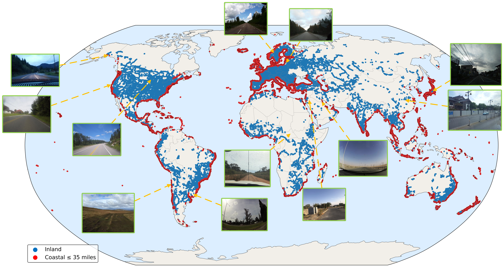

# Seeing Less in a SparseWorld: Cross-View Geolocalization from Limited Field-of-View Observations

<div style="text-align: center;">
  <p align="center">
    <b>Fahimul Aleem · Shruti Vyas</b>
  </p>
</div>

[]()
[]()

<p align="center">
  
</p>

Research utilities for **CVW500k**, a globally distributed cross-view geolocalization dataset, and **GeoQueryNet**, a query-based cross-view fusion transformer.

This repository accompanies the manuscript:

> *Seeing Less in a Sparse World: Cross-View Geolocalization from Limited Field-of-View Observations*

Cross-view geolocalization retrieves the satellite image corresponding to a ground-level query. CVW500k makes this task more representative of real applications: its ground images have a limited field of view rather than the 360° panoramas common in earlier benchmarks, and its samples cover diverse countries, climates, landscapes, road environments, and urban–rural settings.

## Highlights

- **500,098 ground–satellite image pairs** with worldwide coverage
- Ground imagery sampled from OpenStreetView-5M
- Corresponding **640 × 640** satellite images collected at Google Maps zoom level 20
- Limited-field-of-view ground images instead of panoramas
- **438,606 training pairs** and **48,735 test pairs**
- An additional **12,659-pair Australia–New Zealand regional test subset**
- Coastal and inland environments; the paper reports 36% coastal and 64% inland
- Country, region, city, climate, land-cover, road, and coastline-related metadata

## Why CVW500k?

Established datasets such as CVUSA, CVACT, and VIGOR are concentrated in a small number of cities or regions and primarily use panoramic ground views. CVW500k increases geographic diversity and retrieval difficulty by combining world-scale coverage with partial, directional observations.

This introduces several realistic challenges:

- severe viewpoint and scale differences between ground and satellite images;
- limited overlap between a ground image and its satellite counterpart;
- visually repetitive roads, buildings, vegetation, and agricultural patterns;
- sparse and uneven global street-level coverage; and
- architectural, climatic, and cultural variation across regions.

## GeoQueryNet [](https://github.com/Fahim17/CVGL_D10.git)

GeoQueryNet maps ground and satellite images into a shared retrieval space. Its main components are:

1. A shared **CLIP visual encoder** for both views.
2. **LoRA adaptation** for parameter-efficient fine-tuning.
3. A **Cross-View Alignment Module (CVAM)** using learnable query tokens and cross-attention.
4. A contrastive objective that brings matching ground–satellite pairs together and separates non-matching pairs.

The query tokens attend first to limited-FoV ground features and then to satellite features, extracting geographically consistent information despite partial scene overlap. The paper’s training configuration uses a BLIP-2 Q-Former backbone, 768-dimensional embeddings, Adam with a learning rate of `1e-5`, and LoRA rank 32.

## Results

The manuscript reports the following retrieval results on the CVW500k test set:

| Method | R@1 | R@5 | R@10 | R@1% |
| --- | ---: | ---: | ---: | ---: |
| Sample4Geo | 0.22 | 0.86 | 1.52 | 23.98 |
| GeoDTR | 2.01 | 6.95 | 11.08 | 70.44 |
| GeoDTR+ | 2.63 | 8.71 | 13.81 | 75.45 |
| ConGeo | 4.80 | 13.35 | 18.97 | 69.87 |
| MEAN | 3.45 | 11.38 | 17.43 | 80.96 |
| CAMP | 5.47 | 15.87 | 23.38 | 85.07 |
| DSTG | 0.01 | 0.03 | 0.05 | 2.49 |
| QDFL | 8.19 | 19.75 | 26.82 | 38.32 |
| SDPL | 2.30 | 6.77 | 9.98 | 47.02 |
| **GeoQueryNet** | **15.19** | **42.10** | **54.04** | **90.87** |

Values are percentages. R@K measures whether the correct satellite match appears among the first K candidates; R@1% checks whether it appears in the top 1% of the gallery. The paper also finds that both LoRA adaptation and CVAM are important, with LoRA rank 32 producing the strongest R@1, R@5, and R@10 in the reported rank ablation.

## Repository layout

The public Git repository contains lightweight source files and notebooks. Large data and generated artifacts are intentionally excluded by `.gitignore`.

| Tracked source | Purpose |
| --- | --- |
| `main2.py` | Batch-download satellite images for coordinates in an OSV5M CSV |
| `worldmap_display.py` | Create interactive or static maps of dataset coordinates |
| `qualitative_fig.py` | Compare Top-5 retrievals from GeoQueryNet, GeoDTR, and QDFL |
| `helper_func.py` | Experiment logging and runtime helpers |
| `*.ipynb` | Dataset cleaning and exploratory analysis notebooks |

## Expected data format

Each paired dataset row represents one location:

| Column | Description |
| --- | --- |
| `id` | Ground-image identifier |
| `latitude`, `longitude` | Geographic coordinates |
| `country`, `region`, `sub-region`, `city` | Location metadata |
| `gnd_image_path` | Ground-image path relative to the dataset root |
| `sat_image_path` | Paired satellite-image path relative to the dataset root |

Qualitative retrieval files use `query_row_index` as the query identifier. `retrieved_top5_sat_img_ids` contains ranked dataset row indices separated by `|`. Dataset row order must remain unchanged when reproducing an evaluation.

## Usage

### Visualize geographic coverage

```bash
python worldmap_display.py \
  --input csv/all.csv \
  --category-column country \
  --output world_map.html \
  --no-show
```

Use a static extension such as `.png` or `.pdf` for static output. Use `--latitude-column` and `--longitude-column` when a CSV uses different coordinate names.

### Download satellite images

Configure the input CSV, starting row, image count, output directory, and Google Maps Platform credentials in `main2.py`, then run:

```bash
python main2.py
```

Batch downloads may incur API charges. Check the relevant service terms, enabled APIs, billing, and quota before running the script.

## Data and model availability

The dataset, metadata, manuscript, evaluation tables, downloaded images, and generated figures are excluded from Git because of their size, provenance, or local nature. This repository alone is therefore not a complete CVW500k distribution.

Access links for CVW500k data and GeoQueryNet checkpoints have not yet been added. When released, place downloaded data under `datasets/` or update the script paths to match your storage layout.

## Limitations

CVW500k remains spatially sparse at world scale and may leave large regions underrepresented. Repetitive visual patterns can produce plausible but geographically incorrect matches. GeoQueryNet also prioritizes retrieval performance over lightweight deployment and has a higher computational cost than the evaluated baselines.

## Citation

The local manuscript is a draft with placeholder author and DOI fields. A finalized BibTeX entry will be added after publication metadata is available. Until then, refer to the work by its title:

```text
Seeing Less in a Sparse World: Cross-View Geolocalization from
Limited Field-of-View Observations. ACM SIGSPATIAL, 2026.
```

## License

A repository license has not yet been added. The source dataset, Google Maps imagery, metadata sources, and manuscript material remain subject to their respective licenses and service terms.
